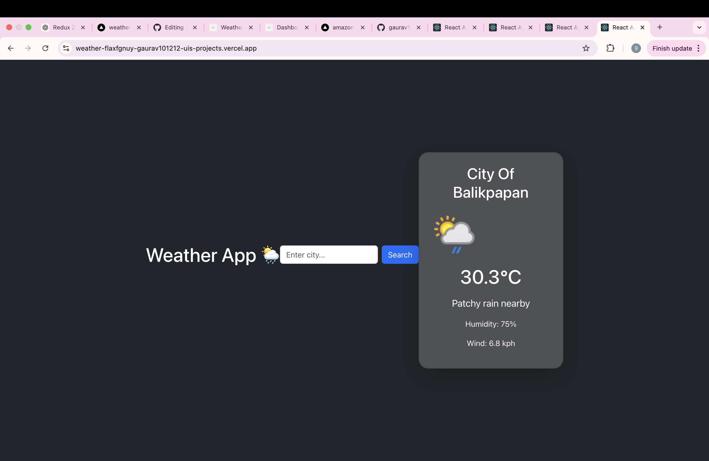

# 🌦️ Weather App

A modern weather application built using React that allows users to search real-time weather data for any city using API integration.

---

## 🚀 Live Demo
[https://YOUR-LIVE-LINK.vercel.app](https://weather-flaxfgnuy-gaurav101212-uis-projects.vercel.app/)

---

## 📌 Features

- 🔍 Search weather by city name
- 🌡️ Real-time temperature display
- 🌥️ Weather condition (clouds, rain, etc.)
- 💧 Humidity and wind speed
- ⚡ Fast and responsive UI

---

## 🛠️ Tech Stack

- React JS
- JavaScript (ES6+)
- CSS / Bootstrap
- OpenWeather API

---

## 📸 Screenshot



----

## 📦 Installation

```bash
npm install
npm start
